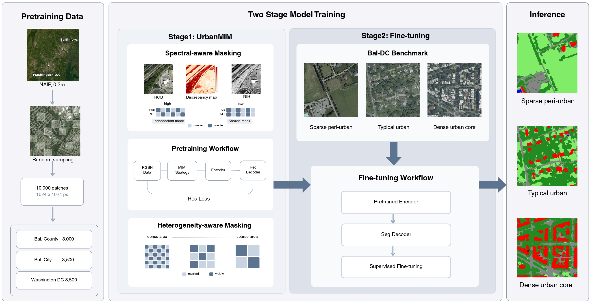

# Bal-DC LULC Atlas: Toward a Foundation Model for Ultra-High-Resolution Urban Land-Cover Classification

**Junhao Wu**, Aboagye-Ntow Stephen, Chuyuan Wang, Michael McGuire, Wei Yu, Jianwu Wang, Xin Huang  
Towson University · University of Maryland, Baltimore County

**[[Project Page](https://wwwjh333.github.io/Bal_lulc_atlas/)]** · **[[Dataset](https://drive.google.com/drive/folders/1Gd9FbzcPZ53MCmZS8FGAk9nLuv0kw1GT?usp=drive_link)]** · **[[Code](https://github.com/wwwjh333/Bal_lulc_atlas)]**

---

## Abstract

Ultra-high-resolution (UHR) remote sensing imagery provides the spatial detail needed for fine-grained urban land-cover understanding in complex urban environments. However, existing methods are still mostly based on coarser-resolution settings or focused on downstream model adaptation for UHR imagery, without representation learning strategies designed for the unique characteristics of UHR data. In this paper, we introduce **Bal-DC LULC Atlas**, a framework for UHR urban land-cover understanding built on large-scale NAIP imagery. **Bal-DC LULC Atlas** consists of two key components: (1) **UrbanMIM**, a masked image modeling pretraining strategy designed for UHR urban data to capture multispectral complementarity and spatial heterogeneity in UHR imagery; and (2) the **Bal-DC LULC Benchmark**, a large-scale annotated benchmark for UHR urban data covering Baltimore and Washington, D.C., with 5 billion labeled pixels for systematic evaluation in complex urban environments. Extensive experiments on this benchmark show that the proposed approach learns representations that capture fine-grained and compositional spatial structures, leading to improved performance on urban land-cover understanding tasks. These results highlight the importance of UHR-specific representation learning for urban land-cover understanding.

---

## Contributions



*Bal-DC LULC Atlas connects UHR-specific masked image modeling, benchmark fine-tuning, and large-scale urban land-cover mapping.*

- We propose **UrbanMIM**, an urban-tailored masked image modeling framework for 0.3 m NAIP RGB–NIR imagery, with **spectral-aware masking** and **heterogeneity-aware masking** to learn UHR-specific representations that capture multispectral complementarity and spatial heterogeneity.

- We release the **Bal-DC LULC Benchmark**, a large-scale annotated dataset spanning sparse peri-urban, typical urban, and dense urban-core environments, with **six land-cover classes** and **5 billion labeled pixels** for systematic evaluation.

- We provide an end-to-end pipeline for **pretraining, fine-tuning, evaluation, and large-scale GeoTIFF inference**, together with an **interactive web atlas** for exploring NAIP imagery and UrbanMIM predictions over the Baltimore region.

---

## Installation

```bash
git clone https://github.com/wwwjh333/Bal_lulc_atlas.git
cd Bal_lulc_atlas

conda create -n bal_dc python=3.10
conda activate bal_dc

pip install -r requirements.txt
```

Download the official [SAM ViT-B checkpoint](https://dl.fbaipublicfiles.com/segment_anything/sam_vit_b_01ec64.pth) and place it at:

```
pretrain_weights/sam/sam_vit_b_01ec64.pth
```

---

## Dataset

Download the **Bal-DC LULC Benchmark** from [[Google Drive](https://drive.google.com/drive/folders/1Gd9FbzcPZ53MCmZS8FGAk9nLuv0kw1GT?usp=drive_link)] and organize it under `./data` as follows:

```
data/
├── bal_dc_benchmark/          # fine-tuning & evaluation
│   ├── images/                # RGB–NIR GeoTIFF tiles
│   ├── labels/                # ground-truth annotation tiles
│   └── training_data/         # cropped patches (generated)
│       ├── images/
│       ├── labels/
│       ├── train.csv
│       └── test.csv
└── pretrain_bal_dc/           # UrbanMIM pretraining
    ├── raw/                   # large NAIP GeoTIFFs
    ├── images/                # cropped patches (generated)
    ├── complexity.json
    └── maps/                  # heterogeneity maps (generated)
```

**Benchmark summary:** 0.3 m NAIP RGB–NIR imagery · Baltimore–Washington D.C. · 5B labeled pixels · 6 land-cover classes

### Prepare fine-tuning patches

```bash
python crop_data_finetune.py --data_dir data/bal_dc_benchmark --output_dir data/bal_dc_benchmark/training_data
python gene_ft_csv.py --data-dir data/bal_dc_benchmark/training_data
```

This creates paired image/label patches and `train.csv` / `test.csv` under `training_data/`.

### Prepare pretraining patches (UrbanMIM)

```bash
python crop_data_pretrain.py --image_folder data/pretrain_bal_dc/raw --output_dir data/pretrain_bal_dc
python precompute_pipeline.py --data_dir data/pretrain_bal_dc/images --out_dir data/pretrain_bal_dc --save_maps
```

`precompute_pipeline.py` computes complexity statistics and heterogeneity maps used by heterogeneity-aware masking during UrbanMIM pretraining.

---

## UrbanMIM Pretraining

```bash
python train_pt.py \
  -dataset bal_dc_simmim \
  -data_path data/pretrain_bal_dc/images \
  -complexity_json data/pretrain_bal_dc/complexity.json \
  -heterogeneity_maps_dir data/pretrain_bal_dc/maps \
  -exp_name bal_dc_mim_pretrain \
  -b 2
```

Checkpoints are saved under `logs/<exp_name>/checkpoints/`. Key options are defined in `train_pt.py` (mask ratios, `tau_d`, learning rate, etc.).

---

## Fine-tuning

```bash
python train_ft.py \
  -dataset bal_dc \
  -data_path data/bal_dc_benchmark/training_data \
  -encoder_pretrain_ckpt logs/bal_dc_mim_pretrain/checkpoints/last.pth \
  -block_type adalora \
  -exp_dir logs/bal_dc_benchmark_urbanmim \
  -epoch 50 \
  -b 2
```

Set `-encoder_pretrain_ckpt` to your UrbanMIM checkpoint. Training logs and weights are written to `logs/<exp_dir>/<timestamp>/`.

---

## Evaluation

```bash
python test.py \
  -data_path data/bal_dc_benchmark/training_data \
  -weights <path_to_your_custom_weights> \
  -b 2
```

Set `-weights` to your fine-tuned checkpoint.

---

## Large-scale Inference

```bash
python predict.py \
  -input data/bal_dc_benchmark/images \
  -output_dir data/bal_dc_benchmark/predictions \
  -weights <path_to_your_custom_weights> \
  -patch_size 1024 \
  -stride 512
```

`predict.py` performs sliding-window inference on large GeoTIFF mosaics and writes land-cover prediction rasters to `-output_dir`.

---

## Acknowledgments

This codebase is built upon [Segment Anything (SAM)](https://github.com/facebookresearch/segment-anything) by Meta AI and [Medical-SAM-Adapter](https://github.com/ImprintLab/Medical-SAM-Adapter). We thank the authors for their open-source work.
